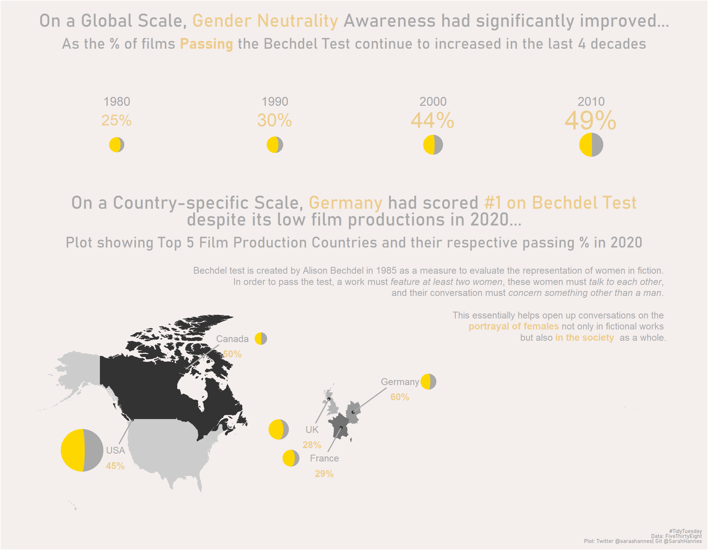
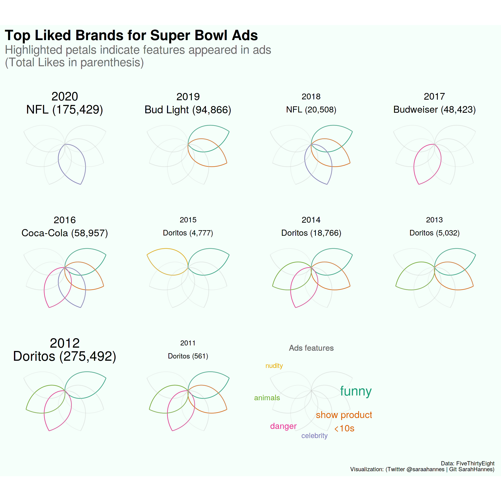

# tidytuesday
Hi there!
  I just started the tidytuesday movement and here are my plots so far 😠*hopefully many more to come~*

### 2021 Week 11 Bechdel Test

 What I leant this week:
- Had fun exploring `geom_🌖` and created map 🌎 for the first time! 
- Learnt how to import fonts yay!
- Finally figured out the best way to combine plots and save it using `ggsave()`

### 2021 Week 10 SuperBowl Ads

 What I leant this week:
 - Using `dplyr::count(col)` as a shorthand to add frequency with grouped by `col`
 - Using `dplyr::top_n(n=1, wt=col)` to get top_n row using `col` as weight
 - Met with roadblock when trying to add image using `ggdraw()` to `coord_polar` plot.. *still figuring this out*
 - Originally wanted to produce something similar like this <a href="https://msucreativecomp.files.wordpress.com/2016/08/data_points.pdf#page=205">starplots by Nathan Yau</a>, but still couldn't figure out how, so this will have to do for now.. 😅
 - Wrestled a lot with angle and radius and arc and what not when I tried to adjust the arc? angle? of the 'petals' so that it doesn't overlap... *really need to brush up on my dusty trig soon. A very humbling experience indeed (lol)*
  

### 2021 Week 9 BLS Employment Data

 What I leant this week:
 - `geom_bar(stat='identity')` and `geom_col()` essentially produce the same output
 - Adjusting upper and lower limit using <a href="https://ggplot2.tidyverse.org/reference/expand_scale.html">`scale_*_continuous(expand = expansion(mult = c( xx, xx )))`</a>
 - Filtering out rows using `%in%` ie `dplyr::filter(!industry %in% c(NA, 'Men', 'Women', 'Asian', 'Black or African American '))`
 - Add `na.rm=T` argument when doing arithmetic operation so that any rows with NA data will be ignored/ parsed as 0 (Otherwise all output with NA rows will be NAs). ie `dplyr::mutate(total=sum(employ_n, na.rm=T))`
  

### 2021 Week 8 W.E.B. Du Bois Challenge

 What I leant this week:
 - Using <a href="https://cran.r-project.org/web/packages/magick/vignettes/intro.html">`library(magick)`</a> to magically✨✨ transform images 😍
 - Using `element_rect(fill = "transparent")` to set the background of plot/panel/legend to transparent
 - Using linetype as aes and setting manual values using `scale_linetype_manual(values=c())`
 - Came across various other customizable <a href="http://www.cookbook-r.com/Graphs/Legends_(ggplot2)/#changing-the-position-of-the-legend">`scale_xxx_yyy*s*`</a> 🤩
 - Fiddled a lot using `legend.position=c()` to try to span the horizontal legend centered across the panel width
 - Combine ggplot object and image object using `ggdraw()`
 - Renewed appreciation for Black History Month!
 - Beautiful <a href="https://github.com/ajstarks/dubois-data-portraits/blob/master/dubois-style.pdf">DuBois style</a> *Thank you @Anthony Starks*
 
  
  <i>Thank you and have a nice day!</i> Sarah🐱‍👤
